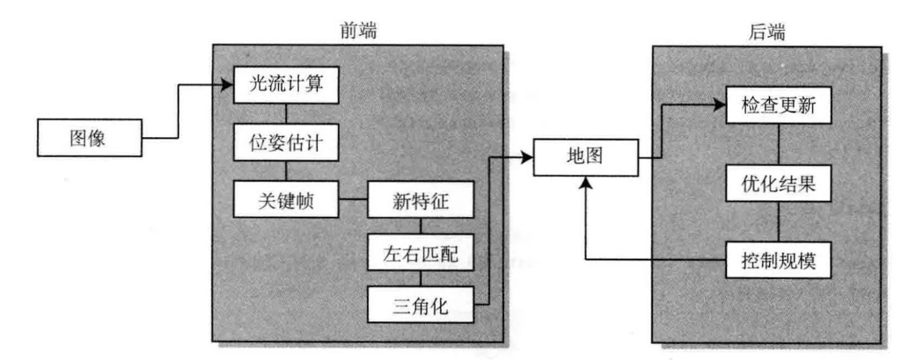

# slambook2-ch13-comments
对SLAM十四讲第二版中的第十三章节工程代码的详细注释




<center>算法框架图</center>


## 总体方案概览

### 工程框架

1. bin存在编译好的可执行程序
2. include存放头文件，include/myslam放自己写的头文件
3. src存放源代码文件
4. test放测试用文件
5. config存放配置文件
6. cmake_modules存放第三方库的cmake文件


双目相机+光流法前端+局部BA后端

前端

- 这是一个基于光流匹配的前端
- 插入新帧+提取特征+光流追踪+三角化，必要时补充新的特征点(补充新的关键帧)


后端


地图


## 前端核心代码详解

1. 初始化：先提取左目图像中的GFTT特征点，再光流法匹配右图中相应的特征点，并将匹配上的特征点进行三角化？
2. 追踪：只使用前后帧的左目图像，通过光流法匹配，然后估计当前帧位姿
3. 追踪到的特征点很少：说明两帧之间差异较大，判定当前帧为关键帧，对于关键帧
   1. 提取新特征点
   2. 计算这些新特征点的空间坐标(路标点)
   3. 将新的关键帧和路标点键入地图
   4. 触发一次后端优化
4. 如果追踪失败，则重置前端系统，重新初始化


### 初始化模块

1. 先提取左图中的GFTT角点，并且设置了最多提取150个角点(在default.yaml文件中的num_features参数)
2. 根据左图提取出的特征点(角点)，**采用LK光流跟踪其在右图中对应的特征点。**在进行光流跟踪之前，可以预先给右图中对应的关键点一个初值，可以加快追踪过程，良好的初值也能使得追踪结果更鲁棒。有以下两种赋初值的策略
   - 第一种：如果左图提取出的特征点有对应的地图点，则我们将该地图点投影到右图上的像素点作为右图中对应特征点位置的初值
   - 第二种：如果左图提取出的特征点没有对应的地图点，则简单的将左图中特征点的位置作为右图中特征点位置的初值。
3. 如果，在右图中找到的对应特征点的数量大于设定的初始化特征点阈值50，则继续进行下面的步骤，否则直接返回，并重新初始化
4. 在满足以上条件后，进行地图的初始化BuildInitMap()
   - 对当前左右目匹配上的特征点进行三角化，得到地图点
   - 地图点对象会将对应的特征点加入到观测中(观测用list类型存储，因为有很多特征点对应一个地图点，一个list存储了该地图点对应的所有特征点)，同样，特征点也会关联其对应的特征点
   - 并将新的地图点插入到地图中
   - 把当前帧判定为关键帧(初始帧默认为关键帧)，并将该帧插入到地图中，且触发一次后端优化(进行一次BA)

5. 若成功构建初始化地图，则将前端的状态切换至TRACKING_GOOD
6. 如果有显示线程，则将当前帧加入到现实线程中，并触发显示线程的更新地图


### Track模块

1. 根据恒速模型估计当前帧的位姿初值

```c++
if (last_frame_) { current_frame_->SetPose(relative_motion_ * last_frame_->Pose()); }
```

2. 根据LK光流跟踪上一帧特征点到当前帧特征点的运动，即利用LK光流跟踪得到前后帧特征点的对应关系(为三角化作准备，类似于特征点法中的特征匹配)
   - 方法和初始化过程中的差不多，只不过在初始化过程中是左右目图像的LK光流跟踪(“特征点匹配”)，现在换成了前后帧左目图像的LK光流跟踪。关于LK光流追踪前特征点位置初值的选取的思想和初始化中是几乎一致的，不再赘述。
3. 使用BA优化估计当前帧位姿(可参考PnP的BA的图优化表示，不过在此例子中，landmarks也当做优化变量)
   - 这里是一个简单的BA过程，固定了路标点，仅仅是把位姿作为优化变量，**以重投影误差最小化为优化目标的优化问题**。而在后端中，不仅仅把位姿作为优化变量，还需要将路标点作为优化变量考虑进去。
4. 如果内点数大于设定的阈值，则认为追踪状态良好，此时前端的状态仍为TRACKING_GOOD,如果比较少，则切换至TRACKING_BAD，如果内点数极少，则切换至LOST
5. 如果内点数少于一定的数量，则插入关键帧。
   - 将当前帧作为关键帧，并将该关键帧插入到地图中
   -  为关键帧左图的特征点对应的地图点(如果有的话)**添加观测**，即在地图点对象(mp_)的成员变量observations _中添加该特征点，即**地图点对象需要将每一个与之对应的特征点添加到observations _中**
   - 检测新的特征点，因为特征点的数量较少，难以满足跟踪要求，需要补充新的特征点。因为当前关键帧左图上已经有一些特征点，并且这些特征点周围的区域已经覆盖了一层掩膜，即在这些特征点的周围区域不再提取新的特征点，这样做也是为了让特征点在图像中分布的更加均匀一点。
   - 根据左图中特征点的位置，使用LK光流追踪右图中对应的特征点
   - 再次三角化，不过**这次只三角化新提取的特征点**。即特征点本身存在关联的地图点就不需要再进行三角化了，只三角化那些左右图匹配上却没有对应的地图点的特征点。
   - 触发后端优化(因为插入了新的关键帧)
6. 更新前后帧相对运动量

```
relative_motion_ = current_frame_->Pose() * last_frame_->Pose().inverse();
```


### 估计当前帧的位姿

#### 恒速模型


#### LK光流

光流描述了像素在图像中的运动，光流是一种描述像素随着时间，在图像之间运动的方法。而我们希望追踪它的运动过程。显然我们在这里只追踪了特征点(部分像素)在图像中的运动，所以是稀疏光流(LK光流是稀疏光流代表)。在SLAM中，LK光流常被用来跟踪角点的运动。

- 跟踪过程中，特征点会不断的丢失（丢失的特征点要么是被移出了视野外，要么就是被其他物体挡住了），那么此时肯定需要提取新的特征点

光流法：保留特征点，但只计算关键点，不计算描述子来**跟踪特征点的运动**。这样可以回避计算和匹配描述子带来的时间，但是光流本身的计算需要一定时间。

光流法仍然使用特征点，只是**把匹配描述子这一步替换成了光流追踪**。估计相机运动时仍使用对极几何、PnP或ICP算法(具体代码是？)。

总而言之：光流法可以加速基于特征点的视觉里程计算法，避免计算和匹配描述子的过程，但要求相机运动较慢(或采集频率较高)


#### 图优化(重点)


## 后端核心代码详解


## 地图核心代码详解


## 核心概念

### 内点和外点


list数据结构：因为要删除跟踪失败的点，所以使用list而不是Vector


## 理论推导部分

### 三角化

- 抓住一点：理论上两幅图像中光心O和特征点P组成的两条射线$O_1p_1$与$O_2p_2$在空间中会相交于一点P，这即是两个特征点所对应的地图点在空间中的位置，**然而由于噪声的存在，这两条直线往往无法相交**。因此，**可以通过最小二乘来求解空间中的位置。**
- 为什么输入的点points是相机归一化平面上的点？
  - 为什么不能直接是像素点
  - 为什么不能是图像坐标系上的点？

```c++
/**
 * linear triangulation with SVD
 * @param poses     poses,
 * @param points    points in normalized plane
 * @param pt_world  triangulated point in the world
 * @return true if success
 */
inline bool triangulation(const std::vector<SE3> &poses,
                   const std::vector<Vec3> points, Vec3 &pt_world) {
    MatXX A(2 * poses.size(), 4);
    VecX b(2 * poses.size());
    b.setZero();
    for (size_t i = 0; i < poses.size(); ++i) {
        Mat34 m = poses[i].matrix3x4();
        A.block<1, 4>(2 * i, 0) = points[i][0] * m.row(2) - m.row(0);
        A.block<1, 4>(2 * i + 1, 0) = points[i][1] * m.row(2) - m.row(1);
    }
    auto svd = A.bdcSvd(Eigen::ComputeThinU | Eigen::ComputeThinV);
    pt_world = (svd.matrixV().col(3) / svd.matrixV()(3, 3)).head<3>();

    if (svd.singularValues()[3] / svd.singularValues()[2] < 1e-2) {
        // 解质量不好，放弃
        return true;
    }
    return false;
}
```


OpenCV同样提供了三角化的接口

```c++
/**
 * triangulation using opencv
 * @param T1     camera pose1的变换矩阵形式
 * @param T2     camera pose2的变换矩阵形式
 * @param pts_1    points in camera1's normalized plane
 * @param pts_1    points in camera2's normalized plane
 * @param pts_4d  triangulated point in the world的齐次坐标表示
 * @return true if success
 */
cv::triangulatePoints(T1,T2,pts_1,pts_2,pts_4d)
```


### 前端的BA优化

- 将问题建模成一个最小二乘的**图优化问题**
- 固定了路标点，仅仅是把位姿作为优化变量

在这个图优化中，，节点和边的选择为：

1. **节点**：当前帧相机的位姿节点，以及所有特征点的空间位置P
2. **边**：每个3D点在当前帧相机的投影

原理：根据一组3D点和它们对应的2D投影点，估计相机的位姿。

g2o提供了许多关于BA的节点和边，我们不必自己从头实现所有的计算。在g2o/types/sba/types_six_dof_expmap.h中提供了李代数表达的节点和边。

- VertexSE3Expmap(李代数位姿类)
- VertexSBAPointXYZ(空间点位置)
- EdgeProjectXYZ2UV(投影方程边)

```c++
int Frontend::EstimateCurrentPose()
{
	//初始化g2o
    typedef g2o::BlockSolver_6_3 BlockSolverType;
    typedef g2o::LinearSolverDense<BlockSolverType::PoseMatrixType> LinearSolverType;
    auto solver = new g2o::OptimizationAlgorithmLevenberg(g2o::make_unique<BlockSolverType>(g2o::make_unique<LinearSolverType>()))
    g2o::SparseOptimizer optimizer;
    optimizer.setAlgorithm(solver);
    
    //Vertex
    VertexPose *vertex_pose = new VertexPose(); 
    vertex_pose->setId(0);
    vertex_pose->setEstimate(current_frame_->pose()); //需要优化的变量
    optimizer.addVertex(vertex_pose);
    
    //K
    Mat33 K = camera_left_->K();
    
    //edges
    int index = 1;
    //一组3D点和2D点
    std::vector<EdgeProjectionPoseOnly *>edges;
    std::vector<Feature::Ptr> features;
    for (size_t i = 0; i < current_frame_->features_left_.size(); ++i)
    {
        auto mp = current_frame_->features_left_[i]->map_point_.lock();
        if (mp) {
            //一组3D地图点和2D特征点
          features.push_back(current_frame_->features_left_[i]);
            //将3D地图点进行重投影
          EdgeProjectionPoseOnly *edge = new EdgeProjectionPoseOnly(mp->pos_, K);
          edge->setId(index);
          edge->setVertex(0, vertex_pose);
            //2D观测
          edge->setMeasurement(
              toVec2(current_frame_->features_left_[i]->position_.pt));
          edge->setInformation(Eigen::Matrix2d::Identity());
          edge->setRobustKernel(new g2o::RobustKernelHuber);
          edges.push_back(edge);
          optimizer.addEdge(edge);
          index++;
    	}
    }
    
    
}
```


#### 卡方检验

卡方检验来区分哪些特征点是内点，那些特征点是外点。[[ORB-SLAM2]卡方分布(Chi-squared)外点(outlier)剔除](https://zhuanlan.zhihu.com/p/58556978)


### 后端的BA优化

路标点和位姿同时进行优化，且问题规模不仅限于前后两帧。


## 代码部分

### 智能指针

#### weak_ptr

在当前帧左图检测完GFTT特征点后，根据当前帧和检测出来的关键点创建一个新的特征点对象，而在这个特征点对象的有参构造函数里面，直接将当前帧赋值给特征点对象中的std::weak_ptr<Frame> frame_ 成员函数了。表示持有该特征的帧。而数据类型为什么使用std::weak_ptr<Frame> 呢？

- 


为什么特征点少了之后，需要补充特征点？

- 需要根据位姿的计算原理来想这个问题，约束变少了？


## Reference

[重读《视觉SLAM十四讲》ch13实践设计SLAM系统](https://zhuanlan.zhihu.com/p/372956625)

